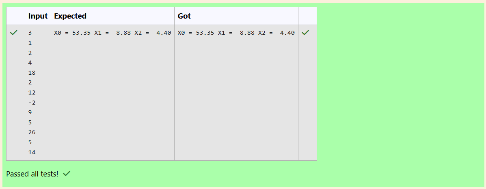

# Gaussian Elimination

## AIM:
To write a program to find the solution of a matrix using Gaussian Elimination.

## Equipments Required:
1. Hardware – PCs
2. Anaconda – Python 3.7 Installation / Moodle-Code Runner

## Algorithm
1. Imported NumPy as np for working with matrices and arrays, and sys for dealing errors.

2. After, we take no of equations (n) from the user.
We then create two arrays:

a, an augmented matrix of size (n × (n+1)) that holds both the coefficients and constants,

x, which is a one-dimensional array used to store the solutions.

3. The program performs forward elimination on the augmented matrix to form an upper triangular matrix and stops if any pivot is zero to prevent division errors.

4. Finally, we use back substitution to calculate the values of all unknown variables one by one, starting from the last equation.

## Program:
```
/*
Program to find the solution of a matrix using Gaussian Elimination.
Developed by: ENBANATHAN V
RegisterNumber: 212224220027
*/
import numpy as np
import sys

n=int(input())
a=np.zeros((n,n+1))
x=np.zeros(n)
for i in range(n):
    for j in range(n+1):
        a[i][j]=float(input())
for i in range(n):
    if a[i][i]==0.0:
        sys.exit('Divide by zero detected!')
    for j in range(i+1,n):
        ratio=a[j][i]/a[i][i]
        
        for k in range(n+1):
            a[j][k]=a[j][k]-ratio*a[i][k]
x[n-1]=a[n-1][n]/a[n-1][n-1]
for i in range(n-2,-1,-1):
    x[i]=a[i][n]
    for j in range(i+1,n):
        x[i]=x[i]-a[i][j]*x[j]
    x[i]=x[i]/a[i][i]
    
for i in range(n):
    print('X%d = %0.2f' %(i,x[i]),end=' ')
```

## Output:



## Result:
Thus the program to find the solution of a matrix using Gaussian Elimination is written and verified using python programming.

